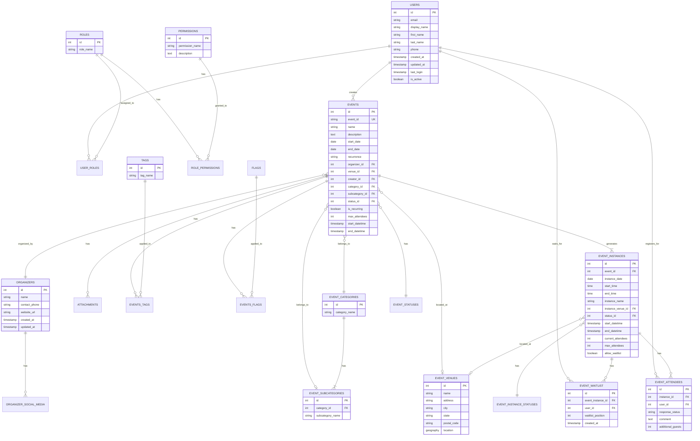

# Database Entity Relationship Diagram

Below is a diagram showing the core entities and their relationships in the Connect More Backend database.

## How to Read This Diagram

This entity-relationship diagram (ERD) shows:

1. **Entities**: Represented by rectangles with their name at the top and attributes listed below
2. **Relationships**: Shown as lines connecting entities with cardinality indicators:
   - `||--||`: One-to-one relationship
   - `||--|{`: One-to-many relationship
   - `}|--|{`: Many-to-many relationship
   - `}o--o|`: Zero-or-one to zero-or-one relationship
   - `}o--|{`: Zero-or-one to many relationship

3. **Key fields**:
   - PK: Primary Key
   - FK: Foreign Key
   - UK: Unique Key

The diagram focuses on the most important entities and relationships in the system, particularly those relevant to event registration and the waitlist functionality. 